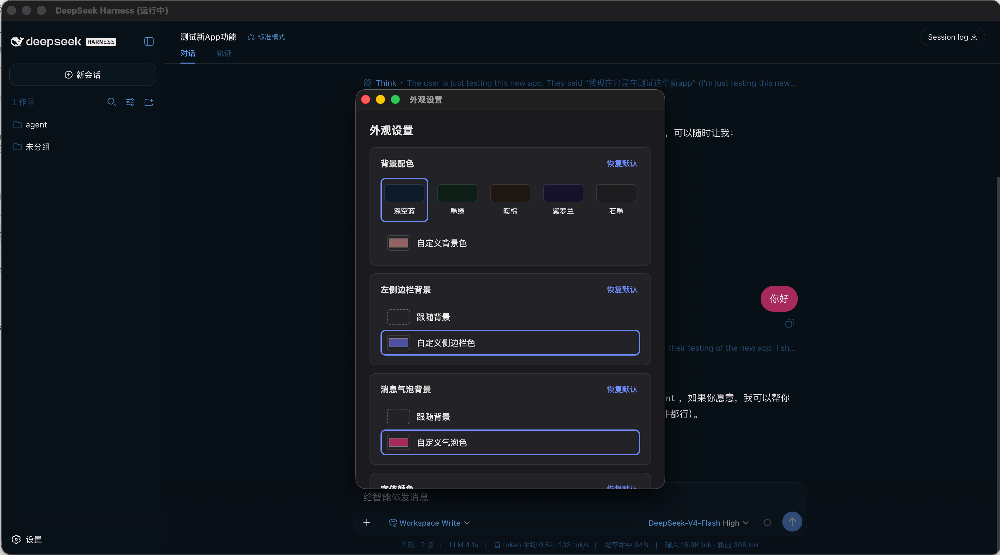

# DeepSeek Deck

**DeepSeek Harness 的轻量化独立桌面应用**，Windows / macOS / Linux 三平台可用。

一个应用，把 DeepSeek Harness 从浏览器里请出来：不用记网址、不用敲命令、不用装 Node.js——下载、安装、双击打开，完事。

> 个人制作桌面版，非 DeepSeek 官方产品。

## 这是什么？

**DeepSeek Harness** 是 DeepSeek 官方的 AI 智能体工作台。简单说：它是一个跑在你电脑上的 AI 工作环境，能帮你写代码、查资料、建知识库、编排多步骤任务。官方版本是一个本地网页服务，平时你得开浏览器、输入网址才能用。

**DeepSeek Deck** 就是给 Harness 配了一个"真正的应用外壳"：独立窗口、系统托盘、服务自动管理。打开它就像打开微信、打开 Obsidian 一样自然——双击图标，界面就出来了。

## 界面长这样


## 用 Deck 和用浏览器有什么区别？

| | 浏览器打开 Harness | DeepSeek Deck |
|---|---|---|
| 打开方式 | 记网址 → 开浏览器 → 找标签页 | 双击图标，即开即用 |
| 窗口 | 和几十个标签挤在一起 | 独立窗口，Command+Tab 直达 |
| 后台 | 关标签就断了 | 托盘驻留，关窗不退出，随时呼出 |
| 服务管理 | 自己启动、自己排查 | 自动拉起、崩溃自愈、托盘一键启停 |
| 安装 | 需要先装 Node.js 和 dsh 命令行工具 | **什么都不用装**，安装包自带一切 |

## 主要功能

- **独立桌面窗口**：Harness 完整界面（会话、工作区、模型切换、工具模式）一个不少，窗口位置大小自动记忆
- **托盘常驻**：服务运行状态一眼可见；显示/隐藏窗口、启停服务、打开浏览器版、退出，都在托盘
- **服务自动管理**：启动时自动拉起 dsh 服务，崩溃自动重连；Windows/Linux 退出应用时自动清理服务进程，不留残留
- **开机自启**（可选）：登录系统后自动运行，随时待命
- **自动检查更新**：dsh 与 Deck 双更新通道——托盘一键检查 dsh（Harness 本体）新版本并可直接一键升级；Deck 自身有新版本时可一键下载安装包
- **内置运行时**：安装包捆绑了 Harness 所需的运行环境，与 Harness 本体更新完全解耦——Harness 升级不需要重新安装 Deck
- **外观设置**：托盘「外观设置…」可自定义界面——背景配色（5 套预设 + 自定义取色）、左侧边栏背景、消息气泡背景、字体颜色、字号，实时生效

## 外观设置

对官方界面的配色不满意？托盘菜单点「外观设置…」，可以按自己的喜好调整：



- **背景配色**：5 套预设主题（深空蓝 / 墨绿 / 暖棕 / 紫罗兰 / 石墨），或用取色器选任意颜色——侧边栏、聊天区、输入框、边框都会跟随整体色调
- **左侧边栏背景**：默认跟随整体背景，也可以单独指定颜色
- **消息气泡背景**：默认跟随整体背景，也可以单独指定（文字颜色会自动适配，保证可读）
- **字体颜色**：自定义界面文字颜色
- **字号**：90%–130% 滑动调节，实时预览

所有改动即时生效并自动保存。

## 下载安装

到 [Releases 页面](https://github.com/MartyYao/deepseek-harness-deck/releases) 下载你的平台对应的文件：

| 你的系统 | 下载哪个 | 怎么装 |
|---|---|---|
| macOS（Apple 芯片） | `DeepSeek.Harness-0.13.0-arm64.dmg` | 打开 dmg，把应用拖进「应用程序」文件夹 |
| macOS（Intel） | `DeepSeek.Harness-0.13.0.dmg` | 同上 |
| Windows | `DeepSeek.Harness.Setup.0.13.0.exe` | 双击安装，一路下一步 |
| Linux | `.AppImage` 或 `.deb` | AppImage：`chmod +x` 后双击；deb：`sudo dpkg -i` 安装 |

> macOS 版本未做代码签名，首次打开如果被系统拦截：右键点击应用 →「打开」即可。Windows 的 SmartScreen 提示选「仍要运行」。

## 使用

- **macOS**：服务由系统 launchd 托管，托盘点「启动 DSH 服务」即可
- **Windows / Linux**：打开应用自动启动服务，关闭应用自动停止，全程不用管
- 服务日志在应用数据目录的 `logs/dsh-web.log`（托盘菜单可直接打开日志文件夹）

### 更新

Deck 有两条独立的更新通道，都在托盘菜单里：

- **检查 dsh 更新…**：检测 Harness 本体（dsh）新版本。使用内置运行时的安装可直接「立即更新」（约 1-3 分钟，更新落在应用数据目录，完成后按提示重启服务生效）；使用系统安装的 dsh 则给出升级命令一键复制。
- **检查 Deck 更新…**：检测 Deck 自身新版本，可「下载并安装」——自动下载对应平台的安装包到下载目录并打开所在文件夹，手动运行覆盖安装即可。

### 已知限制

- 首次启动会把内置运行时（约 350MB）复制到应用数据目录（`userData/dsh-runtime`），dsh 一键更新也落在这里——磁盘上会同时存在安装包内与数据目录两份运行时，属预期设计（安装包内的只读副本作为兜底，不可写）。
- 更新 dsh 后服务不会自动重启，需托盘手动重启服务或重启应用。
- Linux 仅自动下载 AppImage；`.deb` 请到 Releases 页面手动下载。

## 轻量，是我们故意的

Deck 定位就是一个**轻量化的桌面壳**：只做壳该做的事——窗口、托盘、服务管理，不往里塞别的东西。

- 不捆绑插件市场、IM 通道、远程控制这类重功能（这些是 Harness 生态的事，需要时在 Harness 里按需配置即可）
- 与 Harness 通过纯 HTTP 接口通信，不碰它内部任何文件，代码量小、行为可预期
- 资源占用低：一个窗口 + 一个托盘图标，没有常驻后台服务在壳这一层
- 安装包即使用户不装 Node 也能跑（内置运行时），但整个应用不臃肿

想要更多能力，Harness 本体就是答案；Deck 只负责把 Harness 舒服地装进桌面。

## 和官方 DeepSeek Harness 的关系

DeepSeek Harness 的核心能力（AI 引擎、插件系统、网页界面）全部来自官方项目 [deepseek-ai/deepseek-harness](https://github.com/deepseek-ai/deepseek-harness)。本项目只负责桌面封装这一层：

- 桌面应用外壳（窗口、托盘、界面承载）
- 本地服务生命周期管理
- 跨平台安装包构建与发布
- 面向桌面环境的体验优化

**Deck 与 Harness 通过稳定的本地 HTTP 接口通信，完全不碰 Harness 内部文件**，因此 Harness 升级不会影响 Deck，两者互不干扰。

## 从源码构建

```bash
cd dsh-shell/app
npm install
npm run dist:mac    # macOS
npm run dist:win    # Windows
npm run dist:linux  # Linux
```

仓库自带 GitHub Actions：推送 `v*` 标签即自动构建三平台安装包并发布 Release。

## License

本项目使用 **MIT 许可证**（[LICENSE](LICENSE)）。

用大白话说，MIT 是开源世界里最宽松的许可证之一，意思是：

- **你可以自由使用**：包括个人使用、公司商用，都不需要付费，也不需要申请授权
- **你可以自由修改**：按你的需要改代码，甚至改完闭源发布都行
- **你可以自由分发**：重新打包、再发布（包括收费分发）都可以
- **唯一要求**：保留版权声明——分发时带上原作者的版权和许可信息（即 LICENSE 文件不能删）
- **没有担保**：代码按"现状"提供，作者不对使用它造成的任何损失负责

**简单说：随便用、随便改、随便发，保留一句版权声明即可。**

---

*DeepSeek Deck 是基于 DeepSeek Harness 构建的社区桌面版本，与 DeepSeek 官方无隶属关系。*
