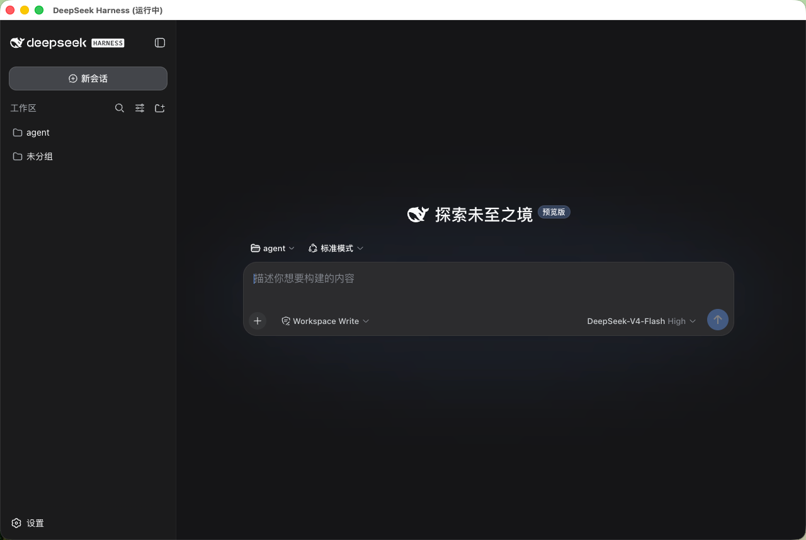

# DeepSeek Deck

**DeepSeek Harness 的独立桌面应用**（Windows / macOS / Linux）。当前版本 **v0.11.0**。

DeepSeek Harness 是 DeepSeek 官方的 AI 智能体工作台：写代码、查资料、建知识库、编排多步骤任务，跑在你自己电脑上的完整 AI 工作环境。官方形态是一个本地网页服务，平时要在浏览器里打开使用。

**DeepSeek Deck 把 Harness 从浏览器里请了出来**——基于 DeepSeek Harness 开发，给它配上了独立的桌面窗口、常驻托盘和服务管理，双击图标就能进，体验和原生软件一样。

> An standalone desktop app for DeepSeek Harness — one window, one tray icon, zero browser tabs. Works on Windows, macOS and Linux.

## 为什么用 Deck 而不是浏览器

| | 浏览器打开 Harness | DeepSeek Deck |
|---|---|---|
| 打开方式 | 记地址、开浏览器、找标签页 | 双击图标，即开即用 |
| 窗口 | 淹没在标签页里 | 独立窗口，Command+Tab 直达 |
| 后台常驻 | 关标签就断了 | 托盘驻留，关窗不退出，随时呼出 |
| 服务管理 | 手动启动/排查 | 自动拉起、崩溃自愈、托盘一键启停 |
| 前置依赖 | 需自装 Node.js 与 dsh | **免安装**：运行时内置在安装包里 |
| 更新 | — | 与 Harness 解耦，Harness 更新无需动 Deck |

## 界面



## 特性

- **免安装**：安装包自带 Node.js 22 + dsh 运行时，下载即用，不需要装任何依赖
- 独立窗口承载 Harness 完整界面（会话、工作区、模型切换、工具模式一个不少）
- 托盘常驻：运行状态一目了然，启停服务/浏览器打开/退出都在托盘
- 服务自动管理：启动时自动拉起 `dsh web`，崩溃自动重连，不需要碰终端
- 桌面体验：开机自启开关、检查更新、一键打开日志目录、加载/错误页跟随系统深浅色
- 窗口状态记忆：记住尺寸位置，拔掉外接显示器自动回正
- 黑渐变海豚图标，三平台原生外观

## 下载

从 [Releases](https://github.com/MartyYao/deepseek-harness-deck/releases) 下载对应平台产物：

| 平台 | 产物 | 说明 |
|---|---|---|
| macOS | `.dmg` / `.zip`（arm64 与 x64 两种） | 未签名：首次打开请右键 →「打开」，或执行 `xattr -dr com.apple.quarantine /Applications/DeepSeek\ Harness.app` |
| Windows | `.exe`（NSIS 安装包） | 双击安装即可 |
| Linux | `.AppImage` / `.deb` | AppImage 先 `chmod +x` 再执行；deb 用 `sudo dpkg -i` 安装 |

> 安装包体积较 v0.10.0 明显增大：内置 Node.js 22（约 106MB）与预装的 dsh 及其依赖（约 343MB，含 node-pty/sharp 等原生模块），未压缩共约 450MB，压缩后安装包预计增加 250–350MB，换来零依赖开箱即用。

## 前置依赖

**无需任何前置依赖。** v0.11.0 起安装包内置完整运行时（Node.js + dsh），下载安装即用。

可选：系统已全局安装 dsh（`npm i -g @deepseek-ai/dsh`）时，Deck 会**优先使用系统版**（便于随 `npm update` 独立升级 Harness）；未安装则自动回退到内置运行时。也可用环境变量 `DSH_BIN` 显式指定 dsh 路径（优先级最高）。

## 使用方法

### macOS

服务由 **launchd 托管**（托盘「启动 DSH 服务」即可，也可用 `deploy/dsh-web-launcher.sh`）。Deck 只发 `launchctl` 命令、不直接拉起服务进程——这保证服务以正确的系统身份运行，首次访问 iCloud 目录时按系统提示授权即可。

### Windows / Linux

Deck 启动时自动 **spawn `dsh web` 子进程**，退出时自动停止（整棵进程树清理，不留孤儿）。dsh 来源按优先级查找：`DSH_BIN` 环境变量 → PATH 中的系统版 → 安装包内置运行时。服务日志在（托盘「打开日志目录」可直达）：

- Windows：`%APPDATA%/DeepSeek Harness/logs/dsh-web.log`
- Linux：`~/.config/DeepSeek Harness/logs/dsh-web.log`

### 托盘菜单

- **DeepSeek Deck v…（服务：运行中/已停止）**：顶部只读状态项
- **显示 / 隐藏窗口**：单击托盘图标同效
- **启动 / 停止 DSH 服务**：macOS 走 launchctl，Windows/Linux 拉起或终止 dsh 子进程
- **在浏览器中打开**：需要浏览器版时随时可切
- **开机自启**：勾选即生效（macOS 登录后静默启动不抢焦点；Linux 不支持，请用系统自启）
- **检查更新…**：对比 GitHub Releases 最新版本，有新版可一键打开下载页
- **打开日志目录**：排障直达服务日志
- **退出**：退出应用（Windows/Linux 一并停止 dsh 子进程）

## 环境变量

| 变量 | 默认 | 说明 |
|---|---|---|
| `DSH_SHELL_URL` | `http://127.0.0.1:3080` | dsh web 地址 |
| `DSH_SHELL_NO_TRAY` | — | 设为非空即不创建托盘（无托盘时关窗即退出） |
| `DSH_BIN` | — | dsh 可执行文件路径覆盖，优先级最高（Windows 上可指向 `dsh.cmd` 全路径）；不设置时依次查 PATH 系统版、内置运行时 |

## 架构

Deck 与 Harness 完全解耦，只依赖稳定的 HTTP 接口（web UI + `/api`），不碰 Harness 内部文件，因此 **Harness 升级不需要重新发布 Deck**。服务生命周期按平台分支：

- **macOS**：launchd 托管。Deck 仅通过 `launchctl bootstrap/kickstart/bootout` 控制，保证服务以正确身份运行（iCloud 授权链不断）
- **Windows / Linux**：子进程模式。Deck spawn `dsh web`（三级查找：`DSH_BIN` → PATH 系统版 → 内置运行时 `resources/node-bin` + `resources/dsh-runtime`），日志落 `userData/logs/dsh-web.log`，退出时终止整棵进程树
- **内置运行时**：官方 Node.js 22 二进制 + 预装的 `@deepseek-ai/dsh`（含原生模块，按标准 Node ABI 编译，与 Electron 内核解耦），构建期由 CI 下载打包（见 `.github/workflows/release.yml`）

## 从源码构建

```bash
cd dsh-shell/app
npm install
# 打包前需先准备内置运行时（否则 electron-builder 因 extraResources 缺失报错），
# 步骤见 .github/workflows/release.yml 的「准备捆绑运行时」：下载 Node 22 到
# resources/node-bin，并用其自带 npm 安装 dsh 到 resources/dsh-runtime
npm run dist:mac    # macOS：dmg + zip（--arm64 / --x64 指定架构）
npm run dist:win    # Windows：nsis 安装包
npm run dist:linux  # Linux：AppImage + deb
```

开发模式 `npm start` 不需要内置运行时——系统已装 dsh 即可正常运行。

仓库带 GitHub Actions（`.github/workflows/release.yml`）：推送 `v*` 标签即三平台矩阵构建（自动准备内置运行时）并发布 Release。

## 已知限制

- 安装包体积：内置运行时（Node + dsh 依赖，未压缩约 450MB）使产物明显增大（一次性下载，省去装依赖）
- macOS 服务依赖 launchd（`LaunchAgents/ai.dsh.web.plist` 需已安装或由 Deck 自动注册）
- Windows / Linux 上服务生命周期绑定应用进程：退出应用即停止服务；需要常驻服务请自行用任务管理器 / systemd 托管 `dsh web`（或开启「开机自启」让 Deck 随系统启动）
- 产物未做代码签名：macOS 首次打开需右键打开 / `xattr` 去隔离，Windows SmartScreen 可能提示

## License

MIT
